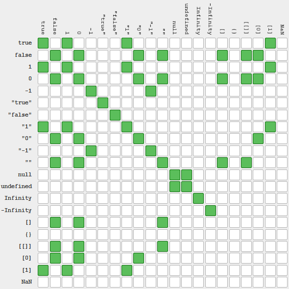

# 操作符特殊规则

## 一元操作符  

| 递增\(++\)和递减\(--\) |
| :--- |
| 在应用于一个包含有效数字字符的字符串时，先将其转换为数字值，再执行加减 1 的操作 |
| 在应用于一个不包含有效数字字符的字符串时，将变量的值设置为 NaN |
| 在应用于布尔值 false 时，先将其转换为 0 再执行加减 1 的操作 |
| 在应用于布尔值 true 时，先将其转换为 1 再执行加减 1 的操作 |
| 在应用于浮点数值时，执行加减 1 的操作 |
| 在应用于对象时，先调用对象的 valueOf\(\) 方法以取得一个可供操作的值。然后对该值应用前述规则。如果结果是 NaN，则在调用 toString\(\)方法后再应用前述规则 |

## 布尔操作符  

| 逻辑非\(!\) |
| :--- |
| 如果操作数是一个对象，返回 false |
| 如果操作数是一个空字符串，返回 true |
| 如果操作数是一个非空字符串，返回 false |
| 如果操作数是数值 0，返回 true |
| 如果操作数是任意非 0 数值\(包括 Infinity\)，返回 false |
| 如果操作数是 null / undefined / NaN，返回 true |

| 逻辑与\(&&\) |
| :--- |
| 如果第一个操作数是对象，则返回第二个操作数 |
| 如果第二个操作数是对象，则只有在第一个操作数的求值结果为 true 的情况下才会返回该对象 |
| 如果两个操作数都是对象，则返回第二个操作数 |
| 如果有一个操作数是 null / undefined / NaN，则返回 null / undefined / NaN |
| 总结：当左边的值与真等价的时候，系统会尝试运算并返回右边的值，无论右边是真是假；左边的值为假的时候系统直接返回左的值，根本不会去尝试运算右 |

| 逻辑或\(\|\|\) |
| :--- |
| 如果第一个操作数是对象，则返回第一个操作数 |
| 如果第一个操作数的求值结果为 false，则返回第二个操作数 |
| 如果两个操作数都是对象，则返回第一个操作数 |
| 如果两个操作数都是 null / undefined / NaN，则返回 null / undefined / NaN |
| 总结：当左边的值与真等价的时候，系统直接返回左边的值，不会尝试运算右边；当左边的值与假等价的时候，系统会尝试运算并返回右边\(不管右是真是假\) |

## 乘性操作符  

| 乘法\(\*\) |
| :--- |
| 如果有一个操作数是 NaN，则结果是 NaN |
| 如果是 Infinity 与 0 相乘，则结果是 NaN |
| 如果是 Infinity 与非 0 数值相乘，则结果是 Infinity 或-Infinity，取决于有符号操作数的符号 |
| 如果是 Infinity 与 Infinity 相乘，则结果是 Infinity |
| 如果有一个操作数不是数值，则在后台调用 Number\(\)将其转换为数值，然后再应用上面的规则 |

| 除法\(/\) |
| :--- |
| 如果有一个操作数是 NaN，则结果是 NaN |
| 如果是 Infinity 被 Infinity 除，则结果是 NaN |
| 如果是零被零除，则结果是 NaN |
| 如果是非零的有限数被零除，则结果是 Infinity 或-Infinity，取决于有符号操作数的符号 |
| 如果是 Infinity 被任何非零数值除，则结果是 Infinity 或-Infinity，取决于有符号操作数的符号 |
| 如果有一个操作数不是数值，则在后台调用 Number\(\)将其转换为数值，然后再应用上面的规则 |

| 求模\(%\) |
| :--- |
| 如果被除数是无穷大值而除数是有限大的数值，则结果是 NaN |
| 如果被除数是有限大的数值而除数是0，则结果是 NaN |
| 如果是 Infinity 被 Infinity 除，则结果是 NaN |
| 如果被除数是有限大的数值而除数是无穷大的数值，则结果是被除数 |
| 如果被除数是0，则结果是0 |
| 如果有一个操作数不是数值，则在后台调用 Number\(\)将其转换为数值，然后再应用上面的规则 |

## 加性操作符  

| 加法\(+\) |
| :--- |
| 如果有一个操作数是 NaN，则结果是 NaN |
| 如果是 Infinity 加 Infinity，则结果是 Infinity |
| 如果是-Infinity 加-Infinity，则结果是-Infinity |
| 如果是 Infinity 加-Infinity，则结果是 NaN |
| 如果是+0 加+0，则结果是+0 |
| 如果是-0 加-0，则结果是-0 |
| 如果是+0 加-0，则结果是+0 |
| 如果两个操作数都是字符串，则将第二个操作数与第一个操作数拼接起来 |
| 如果只有一个操作数是字符串，则将另一个操作数转换为字符串，然后再将两个字符串拼接起来 |
| 如果有一个操作数是对象、数值或布尔值，则调用它们的 toString\(\)方法取得相应的字符串值，然后再应用前面关于字符串的规则。对于 undefined 和 null，则分别调用 String\(\)函数并取得字符u串"undefined"和"null" |

| 减法\(-\) |
| :--- |
| 如果有一个操作数是 NaN，则结果是 NaN |
| 如果是 Infinity 减 Infinity，则结果是 NaN |
| 如果是-Infinity 减-Infinity，则结果是 NaN |
| 如果是 Infinity 减-Infinity，则结果是 Infinity |
| 如果是-Infinity 减 Infinity，则结果是-Infinity |
| 如果是+0 减+0，则结果是+0 |
| 如果是+0 减-0，则结果是-0 |
| 如果是-0 减-0，则结果是+0 |
| 如果有一个操作数是字符串、布尔值、null 或 undefined，则先在后台调用 Number\(\)函数将其转换为数值，然后再根据前面的规则执行减法计算。如果转换的结果是 NaN，则减法的结果就是 NaN，例如：var foo = "11"+2-"1"; foo值 111 |
| 如果有一个操作数是对象，则调用对象的 valueOf\(\)方法以取得表示该对象的数值。如果得到的值是 NaN，则减法的结果就是 NaN。如果对象没有 valueOf\(\)方法，则调用其 toString\(\)方法并将得到的字符串转换为数值 |

## 关系操作符  

| 小于\(&lt;\)、大于\(&gt;\)、小于等于\(&lt;=\)和大于等于\(&gt;=\) |
| :--- |
| 如果两个操作数都是字符串，则比较两个字符串对应的字符编码值 |
| 如果一个操作数是数值，则将另一个操作数转换为一个数值，然后执行数值比较 |
| 如果一个操作数是布尔值，则先将其转换为数值，然后再执行比较 |
| 如果一个操作数是对象，则调用这个对象的 valueOf\(\)方法，用得到的结果按照前面的规则执行比较。如果对象没有 valueOf\(\)方法，则调用 toString\(\)方法，并用得到的结果根据前面的规则执行比较 |

## 相等操作符  

| 相等\(==\)和不相等\(!=\)    先转换再比较， 转换不同的数据类型时 |
| :--- |
| 如果有一个操作数是布尔值，则在比较相等性之前先将其转换为数值——false 转换为 0，而 true 转换为 1 |
| 如果一个操作数是字符串，另一个操作数是数值，在比较相等性之前先将字符串转换为数值 |
| 如果一个操作数是对象，另一个操作数不是，则调用对象的 valueOf\(\)方法，用得到的基本类型值按照前面的规则进行比较 |

| 相等\(==\)和不相等\(!=\)   先转换再比较，  进行比较时 |
| :--- |
| null 和 undefined 是相等的 |
| 要比较相等性之前，不能将 null 和 undefined 转换成其他任何值 |
| 如果有一个操作数是 NaN，则相等操作符返回 false，而不相等操作符返回 true。重要提示:即使两个操作数都是 NaN，相等操作符也返回 false;因为按照规则，NaN 不等于 NaN |
| 如果两个操作数都是对象，则比较它们是不是同一个对象。如果两个操作数都指向同一个对象，则相等操作符返回 true;否则，返回 false |

| 表达式 | 值 | 表达式 | 值 |
| :---: | :---: | :---: | :---: |
| null == undefined | true | true == 1 | true |
| "NaN" == NaN | false | true == 2 | false |
| 5 == NaN | false | undefined == 0 | false |
| NaN == NaN | false | null == 0 | false |
| NaN != NaN | true | false == 0 | true |
| [] == false | true | [] == ![] | true |

