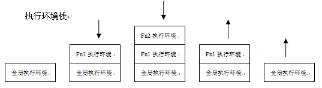

# 4. 变量、作用域和内存问题

## 基本类型值和引用类型值  <a id="primitive&reference-values"></a>

* 基本数据类型是按值访问的，引用类型的值是保存在内存中的对象；
* 基本类型值在内存中占据固定大小的空间，被保存在栈内存中，引用类型的值是对象，保存在堆内存中；
* 值类型赋值时会在内存中开辟一块新的空间，然后把赋过来的值保存于这块新空间中，引用类型赋值时也会开辟一块新的空间，但新空间保存的是赋值对象所在的地址即引用（这就是所谓的浅拷贝）；
* 拓展：**深拷贝和浅拷贝的实现和区别**；
* 引用类型的值是保存在内存中的对象，js不允许直接访问内存中的位置，即不能直接操作对象的内存空间，操作对象时，操作的是对象的引用，为对象添加属性时，操作的是实际的对象；
* 只能给引用类型值动态地添加属性，基本类型添加属性不报错但是访问时是 `undefined`；
* 引用类型值的复制实际上引用的是同一个对象（同一个指针），复制的其实是指针，因此两个变量最终都指向同一个对象；
* ECMAScript所有函数的参数是按值传递，理解当参数是对象时仍然是按值传递而不是按引用，但是参数会按引用来访问这个对象；在函数内部重写 `obj` 时，这个变量引用的就是一个局部对象了。而这个局部对象会在函数执行完毕后立即被销毁；
* ```javascript
  function setName(obj) { 
    obj.name = "Nicholas"; 
    obj = new Object(); 
    obj.name = "Greg";
  }
  var person = new Object();
  setName(person);
  alert(person.name);    //"Nicholas"
  ```

## 检测类型  <a id="determining-type"></a>

* 确定一个值是哪种基本类型可以使用 `typeof` 操作符；
* 确定一个值是哪种引用类型可以使用 `instanceof` 操作符\(返回bool\)，(可以理解为`son instanceof mother`)；
* 引用类型的值都是 `Object` 的实例。因此，`someReferenceVar instanceof Object`，始终会返回 `true`，如果检测基本类型的值，则始终会返回 `false`，因为基本类型不是对象；
* `instanceof` 运算符用来测试一个对象在其原型链（详见第 6 章）中是否存在一个构造函数的 `prototype` 属性；

## 执行环境与作用域  <a id="execution-context-scope"></a>

* JavaScript没有块级作用域；`if` 和 `for {}` 里的变量全局能访问；

* 在 Web 浏览器中，全局执行环境被认为是 [`window` 对象](chapter08.md#window-object)，因此所有全局变量和函数都是作为 `window` 对象的属性和方法创建的；

* 执行环境有全局执行环境\(也称为全局环境\)和函数执行环境之分；

* 在函数外部 用不用var声明的变量均为全局变量；

* 在函数内部：不用var声明的变量为全局变量（但生命周期只从包含函数被调用时才开始有效），用var声明的为局部变量；

  ```js
  function A () {
    B = function () { alert(222)}
  }
  B()  // B is not a function
  --------
  A();
  B(); // alert 222
  ```

* 每个函数都有自己的执行环境。当执行流进入一个函数时，函数的环境就会被推入一个环境栈中。而在函数执行之后，栈将其环境弹出，把控制权返回给之前的执行环境（调用现场）；

  

* 函数被调用时，会创建一个新的执行环境和对应的搜索变量和函数的作用域链，然后使用 `argunments` 和其他命名参数的值来初始化函数的活动对象；

* 后台的每个执行环境都有一个表示变量的对象 —— 变量对象；显然，作用域链本质是一个指向变量对象的指针列表，只引用但不实际包含变量对象；

* 作用域链前端始终都是当前执行的代码所在环境的变量对象；

* 某个执行环境中的所有代码执行完毕后，该环境被销毁，保存在其中的所有变量（局部活动对象）和函数定义也随之销毁\(全局执行环境直到应用程序退出——例如关闭网页或浏览器——时才会被销毁\)；

* 但[闭包又有所不同](chapter07.md#closures)，在另一个函数内部定义的函数会将外部函数的活动对象添加到它的作用域链中；

* 变量的执行环境有助于确定应该何时释放内存；

* 延长作用域链：1. `try-catch` 语句的 `catch` 块；2. `with` 语句；

* 作用域链搜索过程，如果局部环境中存在着同名标识符，就不会使用位于父环境中的标识符；

* 创建作用域链和作用域链的作用对理解[闭包](chapter07.md#closures)至关重要；

## 垃圾收集  <a id="garbage-collection"></a>

* JavaScript 是一门具有自动垃圾收集机制的编程语言；

* 离开作用域的值将被自动标记为可以回收，因此将在垃圾收集期间被删除；

* **标记清除 **是目前主流的垃圾收集算法，这种算法的思想是给当前不使用的值加上标记，然后再回收其内存；

* **引用计数**，这种算法的思想是跟踪记录所有值被引用的次数。JavaScript引擎目前都不再使用这种算法;但在 IE 中访问非原生 JavaScript 对象\(如 `DOM` 元素\)时，这种算法仍然可能会导致问题；

* **循环引用** 指的是对象 A 中包含一个指向对象 B 的指针，而对象 B 中也包含一个指向对象 A 的引用； 

* IE 中有一部分对象并不是原生 JavaScript 对象。例如，其 BOM 和 DOM 中的对象就是使用 C++以 COM（Component Object Model，组件对象模型）对象的形式实现的，而 COM 对象的垃圾收集机制采用的就是引用计数策略。因此，即使 IE 的 JavaScript 引擎是使用标记清除策略来实现的，但JavaScript 访问的 COM 对象依然是基于引用计数策略的。换句话说，只要在 IE 中涉及 COM 对象，就会存在循环引用的问题；

  ```js
  var element = document.getElementById("some_element");
  var myObject = new Object();
  myObject.element = element;
  element.someObject = myObject;
  // 在一个 DOM 元素（element）与一个原生 JavaScript 对象（myObject）之间创建了循环引用。
  // 由于存在这个循环引用，即使将例子中的 DOM 从页面中移除，它也永远不会被回收
  
  myObject.element = null;
  element.someObject = null;
  // 将变量设置为 null 意味着切断变量与它此前引用的值之间的连接。
  // 当垃圾收集器下次运行时，就会删除这些值并回收它们占用的内存
  // 为了解决上述问题， IE9 把 BOM 和 DOM 对象都转换成了真正的 JavaScript 对象。
  // 这样，就避免了两种垃圾收集算法并存导致的问题，也消除了常见的内存泄漏现象
  ```

* 当代码中存在循环引用现象时，“引用计数”算法就会导致问题；

* 解除变量的引用不仅有助于消除循环引用现象，而且对垃圾收集也有好处；

* 为了确保有效地回收内存，应该及时解除不再使用的全局对象、全局对象属性以及循环引用变量的引用；

* 将其值设置为 `null` 来释放其引用——这个 做法叫做解除引用\(dereferencing\)。这一做法适用于大多数全局变量和全局对象的属性。局部变量会在它们离开执行环境时自动被解除引用；

* 解除一个值的引用并不意味着自动回收该值所占用的内存。解除引用的真正作用是让值脱离执行环境，以便垃圾收集器下次运行时将其回收；

## 声明提升  <a id="hoisting"></a>

* 函数及变量的声明（**`var`** 声明 和 **`function`** 声明的标识符）都将被提升到函数的最顶部；

* 函数声明和变量声明都会被提升，但是：函数会首先被提升，然后才是变量。即【函数声明提升】优先级高于【变量声明提升】；

* 变量可以先使用再声明，会发生声明提升，赋值不会提升；

* 函数可以先调用再声明，会发生函数提升（声明函数提升，表达式函数不提升）；

  ```javascript
  // 声明变量提升
  x = 5;
  var y = x;
  var x;
  console.log(y) // 5
  
  var b = a;
  var a = 5;
  console.log(b) // undefined
  // var a;
  // var b = a;
  // a = 5;
  
  var i = 1;
  function F(){
    console.log(i);		//undefined 
    var i = 2;  // 可以看作 var i; 发生声明提升，等价于下例
  }
  F();
  // 等价上例
  var i = 1;
  function F(){
    var i;
    console.log(i);		//undefined 
    i = 2;
  }
  F();
  
  // 函数提升
  console.log(f1); // function f1() {}   
  console.log(f2); // undefined  
  function f1() {}
  var f2 = function() {}
  // 等价于
  function f1() {}
  var f2
  console.log(f1);  
  console.log(f2);
  f2 = function() {}
  
  // 函数提升
  var a = 5;
  function a(b){
    alert(b);
  }
  a(6); // a is not a function 函数提升后 var a = 5 把a覆盖掉了
  // 等价于
  function a(b){
    alert(b);
  }
  var a;
  a = 5
  a(6)
  
  // 如果上述修改一下
  var a;
  function a(b){
    alert(b);
  }
  a(6);  // alert 出 6
  // 原因：如果仅仅是重复声明：声明会被忽略，如果声明同时赋值情况就会变化
  ```

