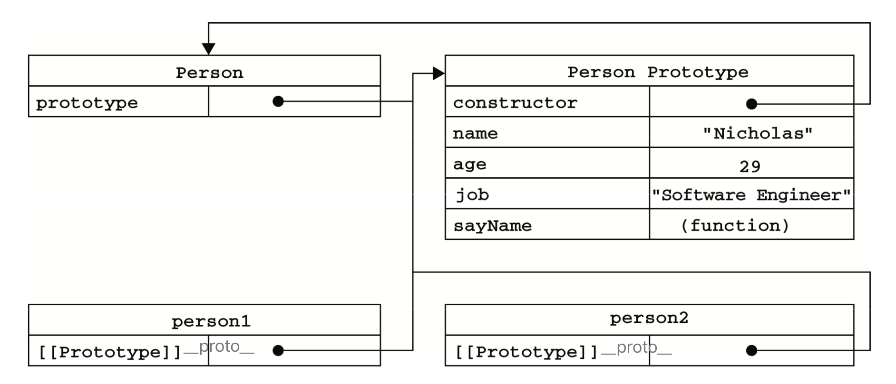

# 6. 面向对象的程序设计

## 创建对象  <a id="create"></a>

### 工厂模式 <a id="factory"></a>
```js
function createPerson(name, age, job){ 
  var o = new Object();
  o.name = name;
  o.age = age;
  o.job = job;
  o.sayName = function(){
  alert(this.name); };
  return o; 
}
var person1 = createPerson("Nicholas", 29, "Software Engineer"); 
var person2 = createPerson("Greg", 27, "Doctor");
```
工厂模式虽然解决了创建多个相似对象的问题，但却没有解决对象识别的问题(即怎样知道一个对象的类型)。

### 构造函数模式  <a id="constructor"></a>

按照惯例，构造函数始终都应该以一个大写字母开头。创建自定义的构造函数意味着将来可以将它的实例标识为一种特定的类型。
```js
function Person(name, age, job){ 
  this.name = name;
  this.age = age;
  this.job = job;
  this.sayName = function(){ 
    alert(this.name);
  }; 
}
var person1 = new Person("Nicholas", 29, "Software Engineer"); 
var person2 = new Person("Greg", 27, "Doctor");
```
`person1` 和 `person2` 分别保存着 `Person` 的一个不同的实例。这两个对象都有一个 `constructor`(构造函数)属性，该属性指向 `Person`。
```js
alert(person1.constructor == Person); //true
alert(person2.constructor == Person); //true

// 创建的所有对象既是 Object 的实例，同时也是 Person 的实例
alert(person1 instanceof Object);  //true
alert(person1 instanceof Person);  //true
```
这种方式定义的构造函数是定义在 `Global` 对象(在浏览器中是 `window` 对象)中。

* **将构造函数当作函数**
  ```js
  // 作为普通函数调用
  Person("Greg", 27, "Doctor"); // 添加到window 
  window.sayName(); //"Greg"
  // 在另一个对象的作用域中调用 
  var o = new Object();
  Person.call(o, "Kristen", 25, "Nurse"); // 或者 apply()
  o.sayName(); //"Kristen"
  ```
* **构造函数的问题**
  每个方法都要在每个实例上重新创建一遍。每个实例都有一个名为 `sayName()` 的方法，但那 两个方法不是同一个 `Function` 的实例。不要忘了——函数是对象，每定义一个函数，也就实例化了一个对象。以这种方式创建函数，会导致不同的作用域链和标识符解析。
  ```js
  alert(person1.sayName == person2.sayName); // false
  ```

### 原型模式  <a id="prototype"></a>

我们创建的每个函数都有一个 `prototype` (原型)属性，这个属性是一个指针，指向一个对象， 保存该类型对象所有实例共享的属性和方法。就是通过调用构造函数而创建的那个对象实例的原型对象。好处是可以让所有对象实例共享它所包含的属性和方法。
```js
function Person(){}
Person.prototype.name = "Nicholas";
Person.prototype.age = 29; 
Person.prototype.job = "Software Engineer"; 
Person.prototype.sayName = function(){
  alert(this.name); 
};
var person1 = new Person(); 
person1.sayName(); //"Nicholas"
var person2 = new Person();
person2.sayName(); //"Nicholas"
alert(person1.sayName == person2.sayName); //true
```
在默认情况下，所有原型对象都会自动获得一个 `constructor`(构造函数)属性，这个属性包含一个指向 `prototype` 属性所在函数的指针。也就是 `Person.prototype.constructor` 指向 `Person`。

* **isPrototypeOf()**
  ```js
  alert(Person.prototype.isPrototypeOf(person1)); //true     
  alert(Person.prototype.isPrototypeOf(person2)); //true
  ```
* **Object.getPrototypeOf()** 
  使用 `Object.getPrototypeOf()` 可以方便地取得一个对象的原型，而这在利用原型实现继承的情况下是非常重要的。
  ```js
  alert(Object.getPrototypeOf(person1) == Person.prototype); //true 
  alert(Object.getPrototypeOf(person1).name); //"Nicholas"
  Object.getPrototypeOf(person1) 
  // {name: "Nicholas", age: 29, job: "Software Engineer", sayName: ƒ, constructor: ƒ}
  ```
读取某个对象的某个属性时，搜索首先从对象实例本身开始，如果没有找到，则继续搜索指针指向的原型对象。  
如果实例中添的属性与实例原型中的一个属性同名，那我们就在实例中创建该属性，该属性将会屏蔽(不会重写)原型中的那个属性。添加这个属性只会阻止我们访问原型中的那个属性。即使将这个属性设置为 `null`，也只会在实例中设置这个属性，而不会恢复其指向原型的连接，使用 `delete` 操作符则可以完全删除实例属性。
```js
// 接开头的例子
person1.name = "Greg";
alert(person1.name); //"Greg"——来自实例 (搜索规则)
alert(person2.name); //"Nicholas"——来自原型

person1.name = null
alert(person1.name); // null
delete person1.name;
alert(person1.name); //"Nicholas"——来自原型
```
* **hasOwnProperty()**
  可以检测一个属性是存在于实例中，还是存在于原型中。这个方法(从 `Object` 继承来的)只在给定属性存在于对象实例中时，才会返回 `true`。
  ```js
  // 接开头的例子
  alert(person1.hasOwnProperty("name")); //false
  person1.name = "Greg";
  alert(person1.name); //"Greg"——来自实例 
  alert(person1.hasOwnProperty("name")); //true
  delete person1.name;
  alert(person1.name); //"Nicholas"——来自原型    
  alert(person1.hasOwnProperty("name")); //false
  ```
* **原型 in 操作符**
  有两种方式使用 `in` 操作符:单独使用和在 `for-in` 循环中使用。`in` 操作符会在通过对象能够访问给定属性时返回 `true`，无论该属性存在于实例中还是原型中。
  ```js
  // 接开头的例子
  alert(person1.hasOwnProperty("name")); //false
  alert("name" in person1);  //true
  person1.name = "Greg";
  alert(person1.name); //"Greg" ——来自实例   
  alert(person1.hasOwnProperty("name")); //true
  alert("name" in person1); //true
  ```
  同时使用 `hasOwnProperty()` 方法和 `in` 操作符，就可以确定该属性到底是存在于对象中，还是存在于原型中。
  ```js
  function hasPrototypeProperty(object, name){
    return !object.hasOwnProperty(name) && (name in object);
  }
  // 接开头例子
  alert(hasPrototypeProperty(person, "name"));  //true
  person.name = "Greg";
  alert(hasPrototypeProperty(person, "name"));  //false
  ```
  在使用 `for-in` 循环时，返回的是所有能够通过对象访问的、可枚举的(enumerated)属性，其中既包括存在于实例中的属性，也包括存在于原型中的属性。
  ```js
  // 接开头例子
  person1.class = 2
  var arr = []
  for (var prop in person1) {
    arr.push(prop)
  }
  console.log(arr) //  ["name", "class", "age", "job", "sayName"]
  ```
* **Object.keys()**
  取得对象上所有可枚举的实例属性。
  ```js
  // 接开头例子
  var keys = Object.keys(Person.prototype);
  alert(keys);    //"name,age,job,sayName" 这个顺序也是它们在 for-in 循环中出现的顺序。
  var p1 = new Person();
  p1.name = "Rob";
  p1.age = 31;
  var p1keys = Object.keys(p1); 
  alert(p1keys); //"name,age" 
  ```
* **Object.getOwnPropertyNames()**
  得到所有实例属性，无论它是否可枚举。
  ```js
  var keys = Object.getOwnPropertyNames(Person.prototype); 
  alert(keys); //"constructor,name,age,job,sayName"
  Object.getOwnPropertyNames(person1);  //["name", "class"]
  ```

* **更简单的原型语法**
  ```js
  function Person(){}
  Person.prototype = {
    constructor : Person, // 为了解决： constructor属性变成了新对象的constructor属性(指向Object构造函数)，不再指向Person函数
    name : "Nicholas",
    age : 29,
    job: "Software Engineer", 
    sayName: function () {
      alert(this.name); 
    }
  };
  ```
  以这种方式重设 `constructo`r 属性会导致它的 `[[Enumerable]]` 特性被设置为 `true`。默认情况下，原生的 `constructor` 属性是不可枚举的。
  ```js
  //重设构造函数，只适用于 ECMAScript 5 兼容的浏览器    
  Object.defineProperty(Person.prototype, "constructor", {
    enumerable: false,
    value: Person
  });
  ```
  
* **原型的动态性** 

  由于在原型中查找值的过程是一次搜索，因此对原型对象所做的任何修改都能够立即从实例上反映出来——即使是先创建了实例后修改原型。因为实例与原型之间的连接只不过是一个指针，而非一个副本。
  ```js
  var friend = new Person();
  Person.prototype.sayHi = function(){ 
    alert("hi");
  };
  friend.sayHi(); //"hi"(没有问题!)
  ```
  可以随时为原型添加属性和方法，并且修改能够立即在所有对象实例中反映出来，但是重写整个原型对象，把原型修改为另外一个对象就等于切断了构造函数与最初原型之间的联系。 请记住:实例中的指针仅指向原型，而不指向构造函数。
  ```js
  function Person(){
  }
  var friend = new Person();
  Person.prototype = { 
    constructor: Person, 
    sayHi: function () {
      alert('hi'); 
    }
  };
  friend.sayHi(); //error
  ```
  

* **原生对象的原型**

  所有原生引用类型(`Object`、`Array`、`String`，等等)都在其构造函数的原型上定义了方法。例如，在 `Array.prototype` 中可以找到 `sort()` 方法，而在 `String.prototype` 中可以找到 `substring()` 方法。
  ```js
  String.prototype.startsWith = function (text) { 
    return this.indexOf(text) == 0;
  };
  var msg = "Hello world!"; 
  alert(msg.startsWith("Hello")); //true
  ```
  通过原生对象的原型，不仅可以取得所有默认方法的引用，而且也可以定义新方法。但不推荐在产品化的程序中修改原生对象的原型。如果因某个实现中缺少某个方法，就在原生对象的原型中添加这个方法，那么当在另一个支持该方法的实现中运行代码时，就可能会导致命名冲突。而且，这样做也可能会意外地重写原生方法。<br />

* **原型对象的问题**

  原型模式的最大问题是由其共享的本性所导致的，这种共享对于函数非常合适，对于基本值的属性也说得过去，毕竟通过在实例上添加一个同名属性，可以隐藏原型中的对应属性。然而，对于包含引用类型值(比如数组)的属性来说，问题就比较突出了。
  ```js
  // 接开头代码
  Person.prototype.friends = ['jaime', 'czm']
  // person1.friends = ['Van'] // 放在实例上的属性
  person1.friends.push("Van"); // 操作原型上的属性
  alert(person1.friends); // "jaime,czm,Van" 
  alert(person2.friends); // "jaime,czm,Van" 
  alert(person1.friends === person2.friends); //true
  ```

### 构造函数+原型模式  <a id="constructor-prototype"></a>

构造函数模式用于定义实例属性，而原型模式用于定义方法和共享的属性。结果，每个实例都会有自己的一份实例属性的副本，但同时又共享着对方法的引用，最大限度地节省了内存。另外，这种混成模式还支持向构造函数传递参数;
```js
function Person(name, age, job){
  this.name = name;
  this.age = age;
  this.job = job;
  this.friends = ["Shelby", "Court"];
}
Person.prototype = { 
  constructor : Person, 
  sayName : function(){
    alert(this.name); 
  }
}
var person1 = new Person("Nicholas", 29, "Software Engineer"); 
var person2 = new Person("Greg", 27, "Doctor");
person1.friends.push("Van"); 
alert(person1.friends); //"Shelby,Count,Van" 
alert(person2.friends); //"Shelby,Count" 
alert(person1.friends === person2.friends); //false
alert(person1.sayName === person2.sayName); //true
```
这种模式是目前使用最广泛、认同度最高的一种创建自定义类型的方法。

### 动态原型模式  <a id="dynamic-prototype"></a>

独立的构造函数和原型。动态原型模式正是致力于解决这个问题的一个方案，它把所有信息都封装在了构造函数中，而通过在构造函数中初始化原型(仅在必要的情况下)，又保持了同时使用构造函数和原型的优点。换句话说，可以通过检查某个应该存在的方法是否有效，来决定是否需要初始化原型。
```js
function Person(name, age, job){
  //属性
  this.name = name; 
  this.age = age; 
  this.job = job;
  //方法
  // 这段代码只会在初次调用构造函数时才会执行。
  if (typeof this.sayName != "function"){
    Person.prototype.sayName = function(){ 
      alert(this.name);
    }; 
  }
  // 此后，原型已经完成初始化，不需要再修改。这里对原型所做的修改，能够立即在所有实例中得到反映。
}
var friend = new Person("Nicholas", 29, "Software Engineer"); 
friend.sayName();
```
`if` 语句检查的可以是初始化之后应该存在的任何属性或方法——不必用一大堆 `if` 语句检查每个属性和每个方法;只要检查其中一个即可。这种模式创建的对象，还可以使用 `instanceof` 操作符确定它的类型。

*使用动态原型模式时，不能使用对象字面量重写原型。如果在已经创建了实例的情况下重写原型，那么就会切断现有实例与新原型之间的联系。*

### 寄生构造函数模式  <a id="parasitic-constructor"></a>

寄生构造函数返回的对象与构造函数或者与构造函数的原型属性之间没有关系;也就是说，构造函数返回的对象与在构造函数外部创建的对象没有什么不同。为此，不能依赖 `instanceof` 操作符来确定对象类型。由于存在上述问题，我们建议在可以使用其他模式的情况下，不要使用这种模式。

### 稳妥构造函数模式  <a id="durable-constructor"></a>

所谓稳妥对象，指的是没有公共属性，而且其方法也不引用 `this` 的对象。稳妥对象最适合在一些安全的环境中(这些环境中会禁止使用 `this` 和 `new`)，或者在防止数据被其他应用程序(如 Mashup 程序)改动时使用。稳妥构造函数遵循与寄生构造函数类似的模式，但有两点不同: 一是新创建对象的实例方法不引用 `this`；二是不使用 `new` 操作符调用构造函数。
使用稳妥构造函数模式创建的对象与构造函数之间也没有什么关系，因此 `instanceof` 操作符对这种对象也没有意义。