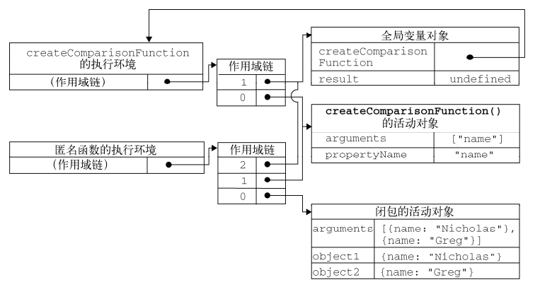

# 7. 函数表达式

## 函数表达式  <a id="expression"></a>

* 函数表达式与其他表达式一样，使用前必须先赋值；所以不像函数声明那样有函数提升；

  ```javascript
  var fnAdd = function(a,b){
    document.write(a+b);
  }
  fnAdd(2,3);
  ```
* 上述示例中，赋值给变量的没有名字的函数叫做[匿名函数](../reference/function.md#anonymous)，有时也叫拉姆达函数；

## 递归  <a id="recursion"></a>

* 递归函数是在一个函数通过名字调用自身的情况下构成的，即函数自己调用自己；
  
* 递归应用场景：无限极分类、文件夹遍历、树形列表等，经典案例：汉诺塔问题；
  
* 递归必须有退出递归的条件否则成为死循环；
  
  ```js
  // 经典阶乘函数
  function factorial (num) {
   return num <= 1 ? 1 : num * factorial(num - 1);
  }
  
  var another = factorial;
  factorial = null;
  another(4); // 出错 factorial is not a function
  ```
  
* 以上代码先把 `factorial()` 函数保存在变量 `another` 中，然后将 `factorial` 变量设置为 `null`，结果指向原始函数的引用只剩下一个。但在接下来调用`another()` 时，由于必须执行 `factorial()`，而 `factorial` 已经不再是函数，所以就会导致错误。在这种情况下，使用 `arguments.callee` 可以解决这个问题；
  
* 递归函数应始终使用 `arguments.callee` 来递归地调用自身，不是用函数名，因其可能发生变化；
  
  ```js
  function factorial (num) {
   return num <= 1 ? 1 : num * arguments.callee(num - 1);
  }
  ```
  
* `arguments.callee`  是指向正在执行的函数的指针，但严格模式下不可用；

* 严格模式或非严格模式下递归调用并降低耦合的方式如下：
  ```js
  var factroial = (function f (num) {
    return num <= 1 ? 1 : num * f(num - 1);
  }) // 外部不能调用f()
  ```

## 闭包 <a id="closures"></a>

**闭包** 是指 可以访问读取其他函数（包含函数）作用域中的变量的函数，创建闭包的常见方式：在一个函数内部创建（声明）另一个函数；

```js
function createCompariFunction (propertyName) {
  return function (obj1, obj2) {
    var value1 = obj1[propertyName]; // 访问了外部函数中的变量propertyName
    var value2 = obj2[propertyName]; // 同上
    if (value1 < value2) {
      return -1;
    } else if (value1 > value2) {
      turn 1;
    } else {
      return 0;
    }
  }
}

//创建函数
var compareNames = createComparisonFunction("name");
//调用函数
var result = compareNames({ name: "Nicholas" }, { name: "Greg" });
//解除对匿名函数的引用（以便释放内存）通知垃圾回收例程将其清除
compareNames = null;

// 对比
var i = 1;
function B () {
  console.log(i);
}
function A () {
  var i = 3;
  B();
}
A();  // 输出3，闭包是一个函数在另一个函数内声明而不是调用，这里是一个回调函数
```

要理解闭包必须深刻理解执行环境和作用域链，详见[第4章](chapter04.md#execution-context-scope)；

在这个例子中，打注释的两行代码访问了外部函数中的变量propertyName，之所以能访问，是因为内部函数的作用域链包含 `createCompariFunction()`  的作用域；

在另一个函数内部定义的函数会将包含函数（即外部函数）的活动对象添加到它的作用域链中。因此，在 `createComparisonFunction()` 函数内部定义的匿名函数的作用域链中，实际上将会包含外部函数 `createComparisonFunction()` 的活动对象。下图展示了当上述列代码执行时，包含函数与内部匿名函数的作用域链。 



在匿名函数从 `createComparisonFunction()` 中被返回后，它的作用域链被初始化为包含 
`createComparisonFunction()` 函数的活动对象和全局变量对象。这样，匿名函数就可以访问在
`createComparisonFunction()` 中定义的所有变量。更为重要的是，`createComparisonFunction()`函数在执行完毕后，其活动对象也不会被销毁，因为匿名函数的作用域链仍然在引用这个活动对象。换句话说，当 `createComparisonFunction()` 函数返回后，其执行环境的作用域链会被销毁，但它的活动对象仍然会留在内存中；直到匿名函数被销毁后， `createComparisonFunction()` 的活动对象才会被销毁；

由于闭包会携带外部函数的作用域，因此比其他函数占更多的内存。建议只在绝对必要时再考虑使用闭包；

#### 闭包与变量  <a id="closures&variables"></a>

* 作用域链的这种配置机制有一个值得注意的副作用，**闭包只能取得包含函数中任何变量的最后一个值**；

  ```js
  function createFunctions(){
    var result = new Array();
    for (var i=0; i < 3; i++){
      result[i] = function(){
        return i;
      };
    }
    return result;
  } // for立即执行的，而闭包函数尚未调用，调用的时候i已经=3了
  var res = createFunctions()
  document.write(res[0]());		// 3
  document.write(res[1]());		// 3
  document.write(res[2]());		// 3
  document.write(res[3]());		// res[3] is not a function
  ```

  表面上看，似乎每个函数都应该返自己的索引值，当 `createFunctions()` 函数返回后，变量 i 的值是 3，此时每个函数都引用着保存变量 i 的同一个变量对象，所以在每个函数内部 i 的值都是 3。但是，我们可以通过创建另一个匿名函数强制让闭包的行为符合预期，如下所示：
  ```js
  function createFunctions(){
    var result = new Array();
      for (var i=0; i < 10; i++){
        result[i] = function(num){
          return function(){
            return num;
        };
      }(i);
    }
    return result;
  }
  // 也可以将原例中的var 换成 let ，与这个版本一样效果
  ```
  在这个版本中，没有直接把闭包赋值给数组，而是定义了一个匿名函数，并将立即执行该匿名函数的结果赋
  给数组。 这里的匿名函数有一个参数 `num`，也就是最终的函数要返回的值。在调用每个匿名函数时，传入了变量` i`。由于函数参数是按值传递的，所以就会将变量 `i` 的当前值复制给参数 `num`。而在这个匿名函数内部，又创建并返回了一个访问 `num` 的闭包。这样一来，` result` 数组中的每个函数都有自己 `num` 变量的一个副本，因此就可以返回各自不同的数值了；

* 经典闭包案例，要深刻理解掌握：

  ```js
  for (var i = 0; i < 5; ++i) {
    setTimeout(function() { 
      console.log('var定义i: '+i) 
    }, 0)
  }
  for (let i = 0; i < 5; ++i) {
    setTimeout(function() { 
      console.log('let定义i: '+i) 
    }, 0)
  }
  // 在for循环内部 var 定义的变量也可以在外部访问到
  // let声明只在代码块中有效
  ```

#### 关于 this 对象  <a id="this-object"></a>

* 在全局函数中， `this` 等于 `window`，而当函数被作为某个对象的方法调用时， `this` 等于那个对象。不过，匿名函数的执行环境具有全局性，因此其 `this` 对象通常指向 `window`，当然，在通过 `call()` 或 `apply()` 改变函数执行环境的情况下，`this` 就会指向其他对象 。 在闭包中使用 `this` 对象可能会导致一些问题；

  ```js
  var name = "The Window";
  var object = {
    name : "My Object",
    getNameFunc : function(){
      return function(){
        return this.name;
      };
    }
  };
  alert(object.getNameFunc()()); //"The Window"（在非严格模式下）
  ```

  为什么匿名函数没有取得其包含作用域（或外部作用域）的 `this` 对象呢？
  前面曾经提到过，每个函数在被调用时都会自动取得两个特殊变量： `this` 和 `rguments`。内部函数在搜索这两个变量时，只会搜索到其活动对象为止，因此永远不可能直接访问外部函数中的这两个变量，不过，把外部作用域中的 this 对象保存在一个闭包能够访问到的变量里，就可以让闭包访问该对象了，如下所示 ：

  ```js
  var name = "The Window";
  var object = {
    name : "My Object",
    getNameFunc : function(){
      var that = this
      return function(){
        return that.name;
      };
    }
  };
  alert(object.getNameFunc()()); //"My Object"
  ```

  把 `this` 对象赋值给了一个名叫 `that` 的变量。而在定义了闭包之后，闭包也可以访问这个变量，因为它是在包含函数中特意声明的一个变量。即使在函数返回之后， `that` 也仍然引用着 `object`，所以调用就返回了"My Object"；

* `arguments `也存在同样的问题。如果想访问作用域中的 arguments 对象，必须将对该对象的引用保存到另一个闭包能够访问的变量中 ;

* 在几种特殊情况下， `this` 的值可能会意外地改变。比如，下面的代码是修改前面例子的结果 ：

  ```js
  var name = "The Window";
  var object = {
    name : "My Object",
    getName: function(){
    	return this.name;
    }
  };
  
  object.getName(); //"My Object"
  (object.getName)(); //"My Object"
  (object.getName = object.getName)(); //"The Window"，在非严格模式下
  ```

  第二行代码在调用这个方法前先给它加上了括号。虽然加上括号之后，就好像只是在引用一个函数，但 `this` 的值得到了维持，因为 `object.getName` 和 `(object.getName)` 的定义是相同的 ；

  第三行代码先执行了一条赋值语句，然后再调用赋值后的结果。因为这个赋值表达式的值是函数本身，所以 `this` 的值不能得到维持，结果就返回了"The Window"；

#### 内存泄漏  <a id="memory-leaks"></a>

由于 IE9 之前的版本对 JScript 对象和 COM 对象使用不同的垃圾收集例程，因此闭包在 IE 的这些版本中会导致一些特殊的问题。具体来说，如果闭包的作用域链中保存着一个HTML 元素，那么就意味着该元素将无法被销毁。来看下面的例子 ：

```js
function assignHandler(){
  var element = document.getElementById("someElement");
  element.onclick = function(){
  	alert(element.id);
  };
}
```

以上代码创建了一个作为 `element` 元素事件处理程序的闭包，而这个闭包则又创建了一个循环引用（[第4章 - 垃圾收集](chapter04.md#garbage-collection)已经学习过）；由于匿名函数保存了一个对 `assignHandler()` 的活动对象的引用，因此就会导致无法减少 `element` 的引用数。只要匿名函数存在， `element` 的引用数至少也是 1，因此它所占用的内存就永远不会被回收 。不过，这个问题可以通过稍微改写一下代码来消除循环引用，如下所示 ：

```js
function assignHandler(){
  var element = document.getElementById("someElement");
  var id = element.id;
  element.onclick = function(){
  	alert(id);
  };
  element = null;
}
```

通过把 `element.id` 的一个副本保存在一个变量中，并且在闭包中引用该变量消除了循环引用。但还是不能解决内存泄漏的问题。必须要记住：**闭包会引用包含函数的整个活动对象**，而其中包含着 `element`。即使闭包不直接引用 `element`，包含函数的活动对象中也仍然会保存一个引用。因此，把 `element` 变量设置为 **`null`**。这样就能够解除对 DOM 对象的引用，顺利地减少其引用数，确保正常回收其占用的内存 ；

## 模仿块级作用域 <a id="mimicking-block-scope"></a>
* JavaScript没有块级作用域的概念，匿名函数可以用来模仿块级作用域，用作块级作用域（通常称为**私有作用域**）的匿名函数的语法如下所示：

  ```js
  (function() {
    // 这里是块级作用域
  })();
  ```
  
* 无论在什么地方，只要临时需要一些变量，就可以使用私有作用域；

  ```js
  function F (count) {
    (function () {
      for (var i=0; i<count; i++) {
        alert(i);
      }
    })();
    alert(i); // 报错：i is not defined
  }
  ```

  这个例子中，我们在 `for` 循环外部插入了一个私有作用域，在匿名函数中定义的任何变量，都会在执行结束时被销毁；

* 这种用法经常在全局作用域中被用在函数外部，从而限制向全局作用域中添加过多的变量和函数；一般来说，应当尽量少向全局作用域中添加变量和函数，通过创建私有作用域，协作开发的每个开发人员能使用自己的变量而不会污染全局作用域；
  ```js
  (function(){
    var now = new Date();
    if (now.getMonth() == 0 && now.getDate() == 1){
    	alert("Happy new year!");
    }
  })();
  ```

  上述代码放在全局作用域中使用，其中给的 `now` 是匿名函数中的局部变量，不必在全局创建；这种做法可以减少闭包占用的内存问题，因为没有指向匿名函数的引用，只要函数执行完毕，就立即销毁其作用域了； 

## 私有变量 <a id="private-variables"></a>

- 任何在函数内部定义的变量，都可以认为是私有变量；利用闭包能通过自己的作用域链可以访问这些变量的特点，就可以创建用于访问私有变量的公有方法。故把有权访问私有变量和私有函数的公有方法成为**特权方法**；

  ```js
  function Person(name){
    this.getName = function(){
      return name;
    }; // 特权方法
    this.setName = function (value) {
      name = value;
    }; // 特权方法
  }
  var person1 = new Person("Nicholas");
  var person2 = new Person("Jaime");
  alert(person1.getName()); //"Nicholas"  // 特权方法可以在构造函数外部使用，  有权访问私有变量name
  alert(person2.getName()); //"Jaime"  // 每个实例都会创建一次该方法
  person1.setName("Greg");                       
  alert(person1.getName()); //"Greg"
  ```

- 能够在构造函数中定义特权方法，是因为特权方法作为闭包有权访问在构造函数中定义的所有变量和函数；但在`Person` 构造函数外部，没有任何办法访问私有变量 `name` ；

- 这种在构造函数中定义特权方法的缺点：必须使用构造函数达到目的，而构造函数的缺点是针对每个实例都会创建同样的一组新方法；使用 **静态私有变量** 实现特权方法可以避免这一问题；

#### 静态私有变量 <a id="static-private-variables"></a>

- 通过在私有作用域中定义私有变量或函数，也能创建特权方法；

  ```js
  (function () {
    var name = ''
    Person = function (val) {
      name = val
    } // 没有用函数声明，函数声明只能创建局部函数
    Person.prototype.getName = function () {
      return name
    }
  })()
  var p1 = new Person('jaime')
  var p2 = new Person('cheng')
  console.log(p1.getName()) // cheng
  console.log(p2.getName()) // cheng
  ```
  
- 在私有作用域中，定义了私有变量和私有函数，然后又定义了构造函数及其公有方法，公有方法是在其原型上定义的，这点体现了典型的原型模式；

- 这种模式与在构造函数中定义特权方法区别，在于私有变量和函数是由实例共享，因为特权方法是在原型上定义，因此所有实例都是用同一个函数；上例中，变量 `name` 就变成了一个静态的、由所有实例共享的属性；

- 这种方式创建静态私有变量会因为使用原型而增加代码复用，但每个实例没有自己的私有变量，具体怎么使用两种方式视你的需求而定；该模式主要用于为自定义类型创建私有变量和特权方法；

- 多查找作用域链中的一个层次，就会在一定程度上影响查找速度，而这正是使用闭包和私有变量的明显不足；

#### 模块模式 <a id="module-pattern"></a>

前面的模式是用于为自定义类型创建的私有变量和特权方法，而模块模式是为单例创建私有变量和特权方法；所谓单例，指的就是只有一个实例的对象；照惯例，js是以对象字面量来创建单例对象的；

```js
var application = function(){
  //私有变量和函数
  var components = new Array();
  //初始化
  components.push(new BaseComponent()); // 这里不需要关心BaseComponent的代码
  //公共
  return {
    getComponentCount : function(){
      return components.length;
    },
    registerComponent : function(component){
      if (typeof component == "object"){
        components.push(component);
      }
    }
  };
}();
```

- **模块模式**使用了一个返回对象字面量的匿名函数；从本质讲，这个对象字面量定义的是单例的公共接口；这种模式在需要对单例进行某些初始化，同时又需要维护其私有变量时是非常有用的；
- 简言之，如果必须创建一个对象并以某些数据对其进行初始化，同时还要公开一些能够访问这些私有数据的方法，那么就可以使用**模块模式**；以这种模式创建的每个单例都是 `Object` 的实例，因为最终都要以一个对象字面量来表示它；

#### 增强的模块模式 <a id="module-augmentation-pattern"></a>

在返回对象之前加入对其增强的代码，这种增强的模块模式适合那些单例必须是某种类型的实例，同时还必须添加某些属性或方法对其加以增强的情况；

如果上述模块模式的例子中 `application` 对象必须是 `BaseComponent` 的实例，那么就可以如下改造：

```js
var application = function(){
  //私有变量和函数
  var components = new Array();
  //初始化
  components.push(new BaseComponent());
  //创建 application 的一个局部副本
  var app = new BaseComponent();
  //公共接口
  app.getComponentCount = function(){
    return components.length;
  };
  app.registerComponent = function(component){
    if (typeof component == "object"){
      components.push(component);
    }
  };
  //返回这个副本
  return app;
}();
```

重写之后的不同之处在于命名变量 `app` 的创建过程，因为他必须是 `BaseComponent` 的实例；这个实例实际上是 `application` 对象的局部变量；