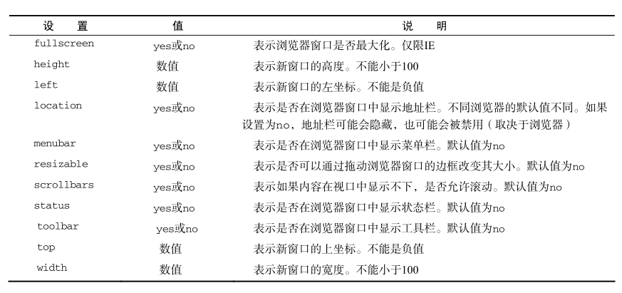
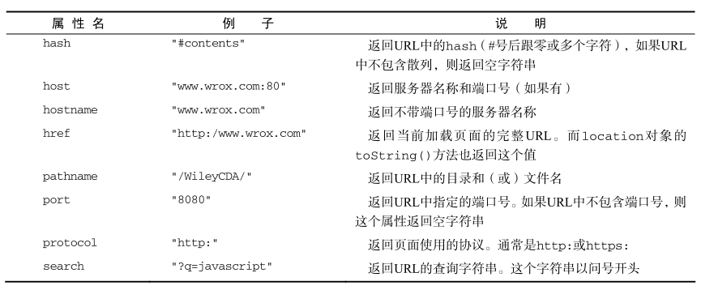
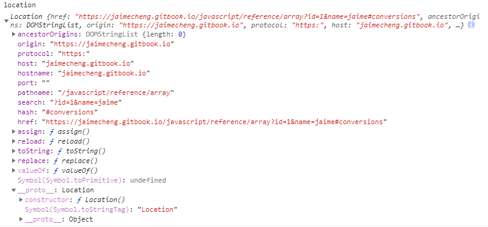
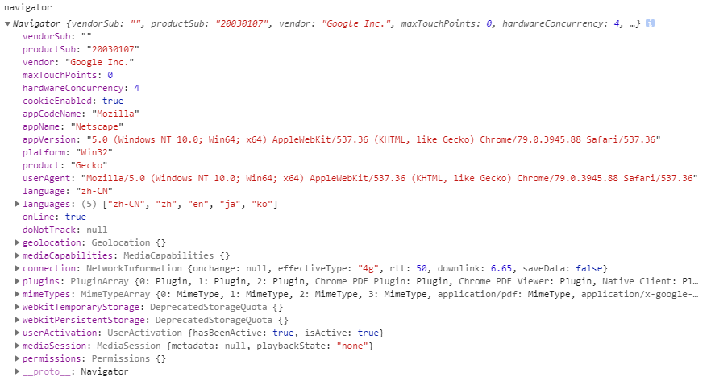

# 8. BOM

## window对象 <a id="window-object"></a>

全局变量会成为 `window` 对象的属性，但是定全局变量与在 `window` 对象上直接定义属性的差别：全局变量不能通过 `delete` 操作符删除，而直接在 window 对象上的定义的属性可以。 
```js
var age = 29; 
window.color = "red";
//在IE < 9 时抛出错误，在其他所有浏览器中都返回false 
delete window.age;
//在IE < 9 时抛出错误，在其他所有浏览器中都返回true 
delete window.color; //returns true
alert(window.age); //29
alert(window.color); //undefined
```
* **窗口位置**
  下列代码可以跨浏览器取得窗口左边和上边的位置：
  ```js
  var leftPos = (typeof window.screenLeft == "number") ? window.screenLeft : window.screenX;
var topPos = (typeof window.screenTop == "number") ? window.screenTop : window.screenY;
  ```
  但不同浏览器的坐标起点不同，无法在跨浏览器的条件下取得窗口左边和上边的精确坐标值。

* **窗口大小**
  不同浏览器会有所不同。IE9+、Firefox、Safari、Opera 和 Chrome 提供以下4个属性：
  ```js
  window.outerWidth;
  window.outerHeight;
  window.innerWidth;
  window.innerHeight;
  // IE8
  document.documentElement.clientWidth;
  document.documentElement.clientHeight;
  // 通常先判断 window.outerWidth 是否可用
  ```
  使用 `resizeTo()` 和 `resizeBy()` 方法可以调整浏览器窗口的大小。这两个方法都接收两个参数，其中 `resizeTo()` 接收浏览器窗口的新宽度和新高度，而 `resizeBy()` 接收新窗口与原窗口的宽度和高度之差。有可能被浏览器禁用，同样不适用于框架，而只能对最外层的
`window` 对象使用。
  ```js
  //调整到 100×100
  window.resizeTo(100, 100);
  //调整到 200×150
  window.resizeBy(100, 50);
  //调整到 300×300
  window.resizeTo(300, 300);
  ```
* **导航和打开窗口**
  `window.open` 接收 4 个参数：要加载的 URL、窗口目标、一个特性字符串以及一个表 示新页面是否取代浏器历史记录中当前加载页面的布尔值。通常只须传递第一个参数，最后一个参数只在不打开新窗口的情况下使用。此外，第二个参数也可以是下列任何一个特殊的窗口名称： `_self` 、 `_parent` 、 `_top` 或 `_blank` 。第三个参数是一个逗号分隔的设置字符串，表示在新窗口中都显示哪些特性。下表列出了可以出现在这个字符串中的设置选项。
  
  ```js
  // 等同于< a href="http://www.wrox.com" target="topFrame"></a>
  window.open("http://www.wrox.com/", "topFrame"); 
  var wroxWin = window.open("http://www.wrox.com/","wroxWindow",
  "height=400,width=400,top=10,left=10,resizable=yes");
  // 调整大小
  wroxWin.resizeTo(500,500);
  // 移动位置
  wroxWin.moveTo(100,100);
  // 关闭
  wroxWin.close();
  alert(wroxWin.closed); //true
  ```
  大多数浏览器都内置有弹出窗口屏蔽程序。浏览器内置的屏蔽程序阻止的弹出窗口，那
么 `window.open()` 很可能会返回 `null`，浏览器扩展或其他程序阻止通常会抛出一个错误。
  ```js
  var blocked = false;
  try {
    var wroxWin = window.open("http://www.wrox.com", "_blank");
    if (wroxWin == null){
      blocked = true;
    }
  } catch (ex){
    blocked = true;
  }
  if (blocked){
    alert("The popup was blocked!");
  }
  ```
* **setTimeout()和setInterval()**
  异步方法，类似预约制排队取号。`setTimeout` 都是在全局作用域中执行的，因此函数中 `this` 的值在非严格模式下指向 `window` 对象，在严格模式下是 `undefined` 。
  
  ```js
  var timeoutId = setTimeout(function() {
    alert("Hello world!"); // 会返回一个数值 ID
  }, 1000); // 
  //注意：把它取消
  clearTimeout(timeoutId);
  
  var num = 0;
  var max = 10;
  var intervalId = null;
  function incrementNumber() {
    num++;
    //如果执行次数达到了 max 设定的值，则取消后续尚未执行的调用
    if (num == max) {
      clearInterval(intervalId);
      alert("Done");
    }
  }
  intervalId = setInterval(incrementNumber, 500);
  
  function incrementNumber() {
    num++;
    // 如果执行次数未达到 max  设定的值，则设置另一次setTimeout
    if (num < max) {
      setTimeout(incrementNumber, 500);
    } else {
    	alert("Done");
    }
  }
  setTimeout(incrementNumber, 500);
  ```
  一般认为，使用 `setTimeout()` 来模拟 `setInterval()` 是一种最佳模式。在开发环境下，很少使用真正的 `setInterval()`，原因是后一个 `setInterval()` 可能会在前一个 `setInterval()` 结束之前启动。而像前面示例中那样使用 `setTimeout()` ，则完全可以避免这一点。所以，最好不要使用 `setInterval()` 。

* **系统对话框**
  浏览器通过 `alert()` 、 `confirm()` 和 `prompt()` 方法可以调用系统对话框向用户显示消息。通过这几个方法打开的对话框都是同步和模态的。
  ```js
  var result = prompt("What is your name? ", "");
  if (result !== null) {
    alert("Welcome, " + result);
  }
  ```

## location对象 <a id="location-object"></a>

`location` 是最有用的`BOM` 对象之一，保存着当前文档的信息，将 `URL` 解析为独立的片段；既是 `window` 对象的属性，也是 `document` 对象的属性；换句话说，`window.location` 和 `document.location` 引用的是同一个对象。下表列出了它所有属性：



* **位置操作**
  ```js
  // 3种方法 立即打开新 URL 并在浏览器的历史记录中生成一条记录。
  location.assign("http://www.wrox.com");
  window.location = "http://www.wrox.com";
  location.href = "http://www.wrox.com";
  // 不会在历史记录中生成新记录。用户不能回到前一个页面
  location.replace("http://www.wrox.com/");
  // 重新加载 
  location.reload(); // 有可能从缓存中加载）
  location.reload(true); // 从服务器重新加载
  // 位于 reload() 调用之后的代码可能会也可能不会执行，这要取决于网络或系统资源等因素。最好将 reload() 放在代码的最后一行。
  ```
  修改 `location` 对象的其他属性也可以改变当前加载的页面，每次修改 `location` 的属性（ `hash` 除外），页面都会以新 URL 重新加载。
  ```js
  //将 URL 修改为"http://www.wrox.com/WileyCDA/#section1"
  location.hash = "#section1";
  //将 URL 修改为"http://www.wrox.com/WileyCDA/?q=javascript"
  location.search = "?q=javascript";
  //将 URL 修改为"http://www.yahoo.com/WileyCDA/"
  location.hostname = "www.yahoo.com";
  //将 URL 修改为"http://www.yahoo.com/mydir/"
  location.pathname = "mydir";
  //将 URL 修改为"http://www.yahoo.com:8080/WileyCDA/"
  location.port = 8080;
  ```
  
## navigator对象 <a id="navigator-object"></a>

`navigator` 对象与其他 `BOM` 对象的情况一样，每个浏览器中的 `navigator` 对象也都有一套自己的属性。下表列出了存在于所有浏览器中的属性和方法，以及支持它们的浏览器版本。



## screen对象 <a id="screen-object"></a>

`screen` 对象基本上只用来表明客户端的能力，其中包括浏览器窗口外部的显示器的信息，如像素宽度和高度等。每个浏览器(PC/Mobile)中的 `screen` 对象都包含着各不相同的属性，下表列出了所有属性及支持相应属性的浏览器。


## history对象 <a id="history-object"></a>

`history` 对象保存着用户上网的历史记录，从窗口被打开的那一刻算起。
```js
//后退一页
history.go(-1);
//前进一页
history.go(1);
//前进两页
history.go(2);
//跳转到最近的 wrox.com 页面 如果历史记录中不包含该字符串，则什么也不做
history.go("wrox.com");
//后退一页
history.back();
//前进一页
history.forward();
if (history.length == 0){
  //这应该是用户打开窗口后的第一个页面
}
```