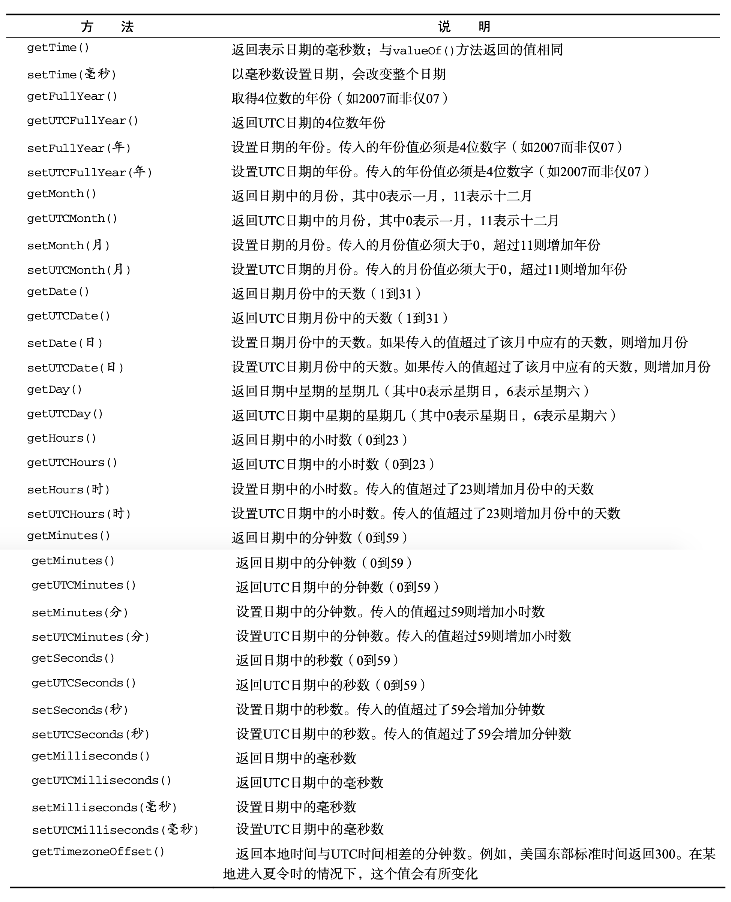

# Date
Date 类型使用自 UTC 1970 年 1 月 1 日午夜(零时)开始经过的毫秒数来保存日期。能够精确到 1970 年 1 月 1 日之前或之后的 285 616 年。

## 创建日期对象   <a id="create"></a>
```js
// 当前日期对象
var now = new Date() // chrome: Mon Mar 09 2020 17:28:07 GMT+0800 (中国标准时间)
// 指定日期对象
var d1 = new Date('2020-01-02T19:13:35+08:00') // Thu Jan 02 2020 19:13:35 GMT+0800 (中国标准时间)
var d2 = new Date(Date.parse("May 25, 2004")) // Tue May 25 2004 00:00:00 GMT+0800 (中国标准时间)
```
实际上，如果直接将表 示日期的字符串传递给 Date 构造函数，也会在后台调用 `Date.parse()`。换句话说，下面的代码与前 面的例子是等价的:  `var d2 = new Date("May 25, 2004")`

## 常用方法   <a id="methods"></a>

* **Date.parse()**：接收一个表示日期的字符串参数，返回相应日期的毫秒数，没有明确定义支持哪种日期格式，因此因实现而异。如果传入字符串不能表示日期，返回 `NaN`；
* **Date.UTC()**：返回表示日期的毫秒数，但它与 `Date.parse()` 在构建值时使用不同的信 息。`Date.UTC()` 的参数分别是年份、基于 0 的月份(一月是 0，二月是 1，以此类推)、月中的哪一天 (1 到 31)、小时数(0 到 23)、分钟、秒以及毫秒数。在这些参数中，只有前两个参数(年和月)是必需的。如果没有提供月中的天数，则假设天数为 1；如果省略其他参数，则统统假设为 0。如同模仿 `Date.parse()` 一样，`Date` 构造函数也会模仿 `Date.UTC()`，但有一点明显不同:日期和时间都基于本地时区而非 GMT 来创建。不过，`Date` 构造函数接收的参数仍然与 `Date.UTC()` 相同；
  
  ```js
  // GMT时间2000年1月1日午夜零时
  var y2k = new Date(Date.UTC(2000, 0));
  // GMT时间2005年5月5日下午5:55:55
  var allFives = new Date(Date.UTC(2005, 4, 5, 17, 55, 55));
  
  // 本地时间2000年1月1日午夜零时 
  var y2k = new Date(2000, 0);
  // 本地时间2005年5月5日下午5:55:55
  var allFives = new Date(2005, 4, 5, 17, 55, 55); // Thu May 05 2005 17:55:55 GMT+0800 (中国标准时间)
  ```
* **Date.now()**：回表示调用这个方法时的日期和时间的毫秒数；支持 `Data.now()` 方法的浏览器包括 IE9+、Firefox 3+、Safari 3+、Opera 10.5 和 Chrome。在不支持它的浏览器中，使用 `+` 操作符把 `Data` 对象转换成字符串，也可以达到同样的目的。
  ```js
  var now = Date.now(); // 1583747583312
  var now = +new Date(); // 同样效果
  ```
  
## 继承的方法   <a id="inherited-methods"></a>

与其他引用类型一样，`Date` 类型也重写了 `toLocaleString()`、`toString()` 和 `valueOf()` 方法; 但这些方法返回的值与其他类型中的方法不同。
* **toLocaleString()**：按照与浏览器设置的地区相适应的格式返回日期和时间，具体的格式会因浏览器而异；
* **toString()**：通常返回带有时区信息的日期和时间，其中时间一般以军用时间(即小时的范围是 0 到 23)表示；
* **valueOf()**：不返回字符串，而是返回日期的毫秒表示。因此，可以方便使用比较操作符(小于或大于)来比较日期值；
  ```js
  var date1 = new Date(2007, 0, 1); 
  var date2 = new Date(2007, 1, 1);
  alert(date1 < date2); //true 在应用于对象时，相应的操作符通常都会调用对象的 valueOf() 和(或)toString()方法，以便取得可以操作的值。
  ```

`toLocaleString()` 和 `toString()` 两个方法在不同的浏览器中返回的日期和时间格式可谓大相径庭。事实上，两者的这一差别仅在调试代码时比较有用，而在显示日期和时间时没有什么价值。

## 日期格式化方法   <a id="date-formatting-methods"></a>

* **toDateString()**：以特定于实现的格式显示星期几、月、日和年;
* **toTimeString()**：以特定于实现的格式显示时、分、秒和时区;
* **toLocaleDateString()**：以特定于地区的格式显示星期几、月、日和年;
* **toLocaleTimeString()**：以特定于实现的格式显示时、分、秒;
* **toUTCString()**：以特定于实现的格式完整的 UTC 日期。

以上这些字符串格式方法的输出也是因浏览器而异的，因此没有哪一个方法能够用来在用户界面中显示一致的日期信息。

## 日期/时间组件方法   <a id="date-time-component-methods"></a>


