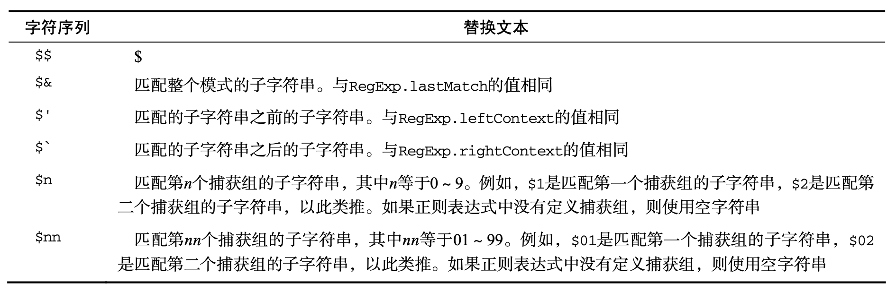

# 基本包装类型
为了便于操作基本类型值，ECMAScript 还提供了 3 个特殊的引用类型: `Boolean`、`Number` 和 `String`。这些类型与其他引用类型相似，但同时也具有与各自的基本类型相应的特殊行为。 实际上，每当读取一个基本类型值的时候，后台就会创建一个对应的基本包装类型的对象，从而能够调用一些方法来操作这些数据。  

引用类型与基本包装类型的主要区别就是对象的生存期。使用 `new` 操作符创建的引用类型的实例， 在执行流离开当前作用域之前都一直保存在内存中。而自动创建的基本包装类型的对象，则只存在于一 行代码的执行瞬间，然后立即被销毁。这意味着我们不能在运行时为基本类型值添加属性和方法。
```js
var s1 = "some text";
s1.color = "red"; 
alert(s1.color); // undefined
```
可以显式地调用 Boolean、Number 和 String 来创建基本包装类型的对象，Object 构造函数也会像工厂方法一样，根据传入值的类型返回相应基本包装类型的实例。
```js
var obj1 = new Object("some text");
var obj2 = new String("some text");
var obj3 = "some text"
alert(obj1 instanceof String);   // true
alert(obj2 instanceof String);   // true
alert(obj3 instanceof String);   // "some text" is not a constructor
```

## Boolean类型   <a id="boolean"></a>

```js
var booleanObject = new Boolean(true);
```
`Boolean` 类型的实例重写了 `valueOf()` 方法，返回基本类型值 `true` 或 `false`；重写了 `toString()` 方法，返回字符串 `"true"` 和 `"false"`。
```js
var falseObject = new Boolean(false); 
var result = falseObject && true; 
alert(result); // true, falseObject 可视作对象 Boolean(falseObject) 为true
var falseValue = false; 
result = falseValue && true; 
alert(result); // false
alert(typeoffalseObject); // object 
alert(typeof falseValue); // boolean 
alert(falseObject instanceof Boolean); // true
alert(falseObject instanceof Object); // true 
alert(falseValue instanceof Boolean); // false
```
理解基本类型的布尔值与 `Boolean` 对象之间的区别非常重要——当然，我们的建议是永远不要使 用 `Boolean` 对象。

## Number类型   <a id="number"></a>

```js
var numberObject = new Number(10);
```
`Number` 类型也重写了` valueOf()`、`toLocaleString()` 和 `toString()` 方法。重写后的 `valueOf()` 方法返回对象表示的基本类型的数值，另外两个方法则返回字符串形式的数值。

### 数值格式化为字符串 <a id=" format-numbers- strings."></a>

- **toFixed()** :  会按照指定的小数位返回数值的字符串表示，接收一个参数，指定输出结果中的小数位数；
  ```js
  var num = 10;
  alert(num.toFixed(2)); // "10.00"
  var num = 10.005
  alert(num.toFixed(2)); // "10.01"
  ```
- **toExponential()**: 返回以指数表示法(也称 e 表示法)表示的数值的字符串形式。接收一个参数，指定输出结果中的小数位数；
  ```js
  var num = 10;
  alert(num.toExponential(1)); // "1.0e+1"
  ```
- **toPrecision()**: 可能会返回固定大小(`fixed`)格式，也可能返回指数(`exponential`)格式;具体规则是看哪种格式最合适。接收一个参数，即表示数值的所有数字的位数(不包括指数部分)。
  ```js
  var num = 99;
  alert(num.toPrecision(1)); // "1e+2"
  alert(num.toPrecision(2)); // "99"     
  alert(num.toPrecision(3)); // "99.0"
  ```
  

`Number` 对象也以后台方式为数值提供了重要的功能。但仍然不建议直接实例化 `Number` 类型。
```js
var numberObject = new Number(10);
var numberValue = 10;
alert(typeof numberObject); // "object" 
alert(typeof numberValue); // "number" 
alert(numberObject instanceof Number); // true 
alert(numberValue instanceof Number); // false
```

## String类型   <a id="string"></a>
```js
var stringObject = new String("hello world");
```
`String` 对象的方法也可以在所有基本的字符串值中访问到。其中，继承的 `valueOf()`、`toLocaleString()` 和 `toString()` 方法，都返回对象所表示的基本字符串值。
`String` 类型的每个实例都有一个 `length` 属性，表示字符串中包含多个字符。
```js
var stringValue = "hello world";
alert(stringValue.length);  // "11" 字符串中包含双字节字符(不是占一个字节的 ASCII 字符)，每个字符也仍然算一个字符
```

### 字符方法 <a id="character-methods"></a>

- **charAt()**
```js
var stringValue = "hello world";
alert(stringValue.charAt(1)); // "e" 也可以 stringValue[1] IE8+
```
- **charCodeAt()**
```js
var stringValue = "hello world";
alert(stringValue.charCodeAt(1)); // 输出"101" 'e'的字符编码
```
### 字符串操作方法 <a id="string-manipulation-methods"></a>

- **concat()**
```js
var stringValue = "hello ";
var result = stringValue.concat("world"); 
alert(result); //"hello world" 
alert(stringValue); //"hello"
var result1 = stringValue.concat("world", "!"); // 可接收多个参数
alert(result1); //"hello world!"
```
- **slice()**
```js
var stringValue = "hello world";
alert(stringValue.slice(3));  // "lo world"
alert(stringValue.slice(-3)); // "rld"
alert(stringValue.slice(3, 7)) // "lo w" 第二个参数表示子字符串到哪里结束
'hello world'.slice(3, 12) // "lo world"
'hello world'.slice(3, 0) // ''
'hello world'.slice(3, -2) // "lo wor"
'hello world'.slice(22) // ""
'hello world'.slice(-22) // "hello world"
alert(stringValue); // "hello world"
```
- **substr()**
```js
var stringValue = "hello world";
alert(stringValue.substr(3));  // "lo world"
alert(stringValue.substr(-3)); // "rld"
alert(stringValue.substr(3, 7)) // "lo worl" 第二个参数返回的字符个数
alert(stringValue.substr(3, -4)); // "" 会将第二个参数转0
alert(stringValue); // "hello world"
```
- **substring()**
```js
var stringValue = "hello world";
alert(stringValue.substring(3)); // "lo world"
alert(stringValue.substring(-3)); // "hello world"
alert(stringValue.substring(3,7)); // "lo w" 第二个参数表示子字符串到哪里结束，与slice的区别：会把所有负值参数都转换为 0
alert(stringValue.substring(3, -4)); // "hel" 会将较小的数作为开始位置，将较大的数作为结束位置， 因此最终相当于调用了 substring(0,3)
alert(stringValue); // "hello world"
```

### 字符串位置方法 <a id="string-location-methods"></a>

- **indexOf()**
```js
var stringValue = "hello world";
alert(stringValue.indexOf("o")); //4
alert(stringValue.indexOf("m")); // -1
alert(stringValue.indexOf("o", 6)); // 7 第二个参数，会从指定的位置向后搜索
```
- **lastIndexOf()**
```js
var stringValue = "hello world";
alert(stringValue.lastIndexOf("o")); // 7
alert(stringValue.lastIndexOf("m")); // -1
alert(stringValue.lastIndexOf("o", 6)); //4 第二个参数，会从指定的位置向前搜索
```

### trim() 方法 <a id="trim-methods"></a>

会创建一个字符串的副本，删除前置及 后缀的所有空格，然后返回结果。
```js
var stringValue = " hello world ";
var trimmedStringValue = stringValue.trim(); 
alert(stringValue); //" hello  world " 
alert(trimmedStringValue); //"hello world"
```
支持这个 方法的浏览器有 IE9+、Firefox 3.5+、Safari 5+、Opera 10.5+和 Chrome。此外，Firefox 3.5+、Safari 5+ 和 Chrome 8+还支持非标准的 `trimLeft()` 和 `trimRight()` 方法，分别用于删除字符串开头和末尾的空格。

### 字符串大小写转换方法 <a id="string-case-methods"></a>
`toLowerCase()`、`toLocaleLowerCase()`、`toUpperCase()` 和 `toLocaleUpperCase()`。 `toLocaleLowerCase()` 和 `toLocaleUpperCase()` 方法是针对特定地区的实现。对有些地区来说，针对地区的方法与其通用方法得到的结果相同，但少数语言(如土耳其语)会为 Unicode 大小写转换应用特殊的规则，这时候就必须使用针对地区的方法来保证实现正确的转换。
```js
var stringValue = "hello world";
alert(stringValue.toLocaleUpperCase()); //"HELLO WORLD"  
alert(stringValue.toUpperCase()); //"HELLO WORLD"    
alert(stringValue.toLocaleLowerCase()); //"hello world"  
alert(stringValue.toLowerCase()); //"hello world"
```

### 字符串的模式匹配方法 <a id="string-pattern-matching-methods"></a>

- **match()**
```js
var text = "cat, bat, sat, fat"; 
var pattern = /.at/;
//与 pattern.exec(text)相同
// match只接受一个参数，正则表达式或 RegExp 对象
var matches = text.match(pattern); // ["cat", index: 0, input: "cat, bat, sat, fat", groups: undefined]
alert(matches.index); //0    
alert(matches[0]); //"cat" 
alert(pattern.lastIndex); //0
```
- **search()**
```js
var text = "cat, bat, sat, fat";
var pos = text.search(/at/); // 只接受一个参数，正则表达式或 RegExp 对象
alert(pos); //1
```
- **replace()**
```js
var text = "cat, bat, sat, fat";
// 两个参数：
// 1) RegExp对象或者一个字符串 
// 2)一个字符串或者一个函数。
var result = text.replace("at", "ond"); // 如果第一个参数是字符串，那么只会替换第一个子字符串。
alert(result); //"cond, bat, sat, fat"
result = text.replace(/at/g, "ond"); // 要想替 换所有子字符串，唯一的办法就是提供一个正则表达式，而且要指定全局(g)标志
alert(result); //"cond, bond, sond, fond"
```
如果第二个参数是字符串，那么还可以使用一些特殊的字符序列，将正则表达式操作得到的值插入 到结果字符串中。下表列出了 ECMAScript 提供的这些特殊的字符序列。

通过这些特殊的字符序列，可以使用最近一次匹配结果中的内容:
```js
var text = "cat, bat, sat, fat";
result = text.replace(/(.at)/g, "word ($1)");
alert(result); //word (cat), word (bat), word (sat), word (fat)
```
`replace()` 方法的第二个参数也可以是一个函数。在只有一个匹配项(即与模式匹配的字符串)的 情况下，会向这个函数传递 3 个参数:模式的匹配项、模式匹配项在字符串中的位置和原始字符串。
```js
function htmlEscape(text){
return text.replace(/[<>"&]/g, function(match, pos, originalText){
switch(match){ case "<":
return case ">":
return case "&":
return case "\"": return
"&lt;"; "&gt;"; "&amp;"; "&quot;";
}
}
}  
alert(htmlEscape("<p class=\"greeting\">Hello world!</p>")); 
//&lt;p class=&quot;greeting&quot;&gt;Hello world!&lt;/p&gt;
```
- **split()**
基于指定的分隔符将一个字符串分割成多个子字符串，并将结果放在一个数组中。分隔符可以是字符串，也可以是一个 `RegExp` 对象。第二个参数，用于指定数组的大小。
```js
var colorText = "red,blue,green,yellow"; 
var colors1 = colorText.split(","); //["red", "blue", "green", "yellow"]
var colors2 = colorText.split(",", 2); //["red", "blue"]
// 对 split()中正则表达式的支持因浏览器而异。
var colors3 = colorText.split(/[^\,]+/); //["", ",", ",", ",", ""] 
```

### localeCompare()方法 <a id="locale-compare-methods"></a>

操作字符串有关的最后一个方法，比较两个字符串，并返回下列值中的一个:
- 如果字符串在字母表中应该排在字符串参数之前，则返回一个负数(大多数情况下是-1，具体的值要视实现而定);
- 如果字符串等于字符串参数，则返回 0;
- 如果字符串在字母表中应该排在字符串参数之后，则返回一个正数(大多数情况下是 1，具体的值同样要视实现而定)。
```js
var stringValue = "yellow"; 
alert(stringValue.localeCompare("brick")); //1 
alert(stringValue.localeCompare("yellow")); //0 
alert(stringValue.localeCompare("zoo")); //-1
stringValue.localeCompare("Yellow") // -1 所以是区分大小写的
// localeCompare()返回的数值取决于实现，所以最好是像下面例子所示
function determineOrder(value) {
  var result = stringValue.localeCompare(value); 
  if (result < 0){
    alert("The string 'yellow' comes before the string '" + value + "'."); 
  } else if (result > 0) {
    alert("The string 'yellow' comes after the string '" + value + "'."); 
  } else {
    alert("The string 'yellow' is equal to the string '" + value + "'.");
  } 
}
determineOrder("brick"); 
determineOrder("yellow"); 
determineOrder("zoo");
```

### fromCharCode()方法 <a id="from-charcode-methods"></a>

`String` 构造函数本身的一个静态方法，接收一或多个字符编码，然后将它们转换成一个字符串。从本质上来看，这个方法与实例方法 `charCodeAt()` 执行的是相反的操作。
```js
alert(String.fromCharCode(104, 101, 108, 108, 111));  // "hello"
```