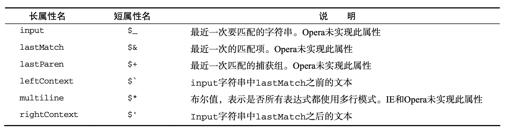

# RegExp

ECMAScript 通过 `RegExp` 类型来支持正则表达式。使用下面类似 Perl 的语法，就可以创建一个正则表达式。
```js
var expression = / pattern / flags ;
```
其中的模式 (pattern) 部分可以是任何简单或复杂的正则表达式，可以包含字符类、限定符、分组、 向前查找以及反向引用。每个正则表达式都可带有一或多个标志 (flags)，用以标明正则表达式的行为。 正则表达式的匹配模式支持下列 3 个标志。
- **g**：表示全局(global)模式，即模式将被应用于所有字符串，而非在发现第一个匹配项时立即 停止；
- **i**：表示不区分大小写(case-insensitive)模式，即在确定匹配项时忽略模式与字符串的大小写；
- **m**：表示多行(multiline)模式，即在到达一行文本末尾时还会继续查找下一行中是否存在与模
式匹配的项。

与其他语言中的正则表达式类似，模式中使用的所有元字符都必须转义。正则表达式中的元字符包括: `(` `[` `{` `\` `^` `$` `|` `)` `?` `*` `+` `.` `]` `}` ，这些元字符在正则表达式中都有一或多种特殊用途，因此如果想要匹配字符串中包含的这些字符，就必须对它们进行转义。
```js
// 字面量形式来定义的正则表达式
var pattern0 = /at/g; // 匹配字符串中所有"at"的实例
var pattern1 = /[bc]at/i; // 匹配第一个"bat"或"cat"，不区分大小写
var pattern2 = /\[bc\]at/i; // 匹配第一个" [bc]at"，不区分大小写
var pattern3 = /.at/gi; // 匹配所有以"at"结尾的 3 个字符的组合，不区分大小写
var pattern4 = /\.at/gi; // 匹配所有".at"，不区分大小写
```
另一种创建正则表达式的方式是使用 `RegExp` 构造函数，它接收两个参数:一个是要匹配的字符串模式，另一个是可选的标志字符串。可以使用字面量定义的任何表达式，都可以使用构造函数来定义:

```js
var pattern1 = /[bc]at/i; // 匹配第一个"bat"或"cat"，不区分大小写
var pattern2 = new RegExp("[bc]at", "i"); // 与 pattern1 相同，只不过是使用构造函数创建的
```
要注意的是，传递给 `RegExp` 构造 函数的两个参数都是字符串(不能把正则表达式字面量传递给 `RegExp` 构造函数)。由于 `RegExp` 构造 函数的模式参数是字符串，所以在某些情况下要对字符进行双重转义。所有元字符都必须双重转义，那些已经转义过的字符也是如此，例如`\n`(字符`\`在字符串中通常被转义为`\\`，而在正则表达式字符串中就变成`\\\\`)。

## 实例属性 <a id="instance-properties"></a>

`RegExp` 的每个实例都具有下列属性，通过这些属性可以取得有关模式的各种信息，但却没有多大用处，因为这些信息全都包含在模式声明中。

- **global**：布尔值，表示是否设置了 g 标志；
- **gnoreCase**：布尔值，表示是否设置了 i 标志；
- **lastIndex**：整数，表示开始搜索下一个匹配项的字符位置，从 0 算起；
- **multiline**：布尔值，表示是否设置了 m 标志；
- **source**：正则表达式的字符串表示，按照字面量形式而非传入构造函数中的字符串模式返回。保存的是规范形式的字符串，即字面量形式所用的字符串。
```js
var pattern2 = new RegExp("\\[bc\\]at", "i");
alert(pattern2.global); //false
alert(pattern2.ignoreCase); //true
alert(pattern2.multiline); //false
alert(pattern2.lastIndex); //0
alert(pattern2.source); //"\[bc\]at"
```

## 实例方法 <a id="instance-methods"></a>

- **exec()**：专门为捕获组而设计的。接受一个参数，即 要应用模式的字符串，然后返回包含第一个匹配项信息的数组；或者在没有匹配项的情况下返回 `null`。返回的数组虽然是 `Array` 的实例，但包含两个额外的属性：`index` 和 `input`。
  ```js
  var text = "mom and dad and baby";
  var pattern = /mom( and dad( and baby)?)?/gi;
  var matches = pattern.exec(text);
  // ["mom and dad and baby", " and dad and baby", " and baby", index: 0, input: "mom and dad and baby", groups: undefined]
  alert(matches.index); // 0, 匹配项在字符串中的位置
  alert(matches.input); // "mom and dad and baby", 应用正则表达式的字符串
  alert(matches[0]); // 数组第一项与整个模式匹配的字符串
  alert(matches[1]); // 数组其他项是与模式中的捕获组匹配的字符串(如果模式中没有捕获组，则该数组只包含一项)。
  alert(matches[2]);
  ```
  对于 `exec()` 方法而言，即使在模式中设置了全局标志(g)，它每次也只会返回一个匹配项。在不设置全局标志的情况下，在同一个字符串上多次调用 `exec()` 将始终返回第一个匹配项的信息。而在设置全局标志的情况下，每次调用 `exec()` 则都会在字符串中继续查找新匹配项。
  ```js
  var text = "cat, bat, sat, fat"; 
  var pattern1 = /.at/;
  var matches = pattern1.exec(text); 
  alert(matches.index); //0 
  alert(matches[0]); //cat 
  alert(pattern1.lastIndex); //0
  matches = pattern1.exec(text); 
  alert(matches.index); //0 
  alert(matches[0]); //cat 
  alert(pattern1.lastIndex); //0
  var pattern2 = /.at/g;
  var matches = pattern2.exec(text); 
  alert(matches.index); //0 
  alert(matches[0]); //cat 
  alert(pattern2.lastIndex); //3
  matches = pattern2.exec(text); 
  alert(matches.index); //5 
  alert(matches[0]); //bat 
  alert(pattern2.lastIndex); //8
  ```
   *IE 的 JavaScript 实现在 `lastIndex` 属性上存在偏差，即使在非全局模式下，`lastIndex` 属性每次也会变化。*

- **test()**：接受一个字符串参数。在模式与该参数匹配的情况下返回 `true`；否则返回 `false`。
  ```js
  var text = "000-00-0000";
  var pattern = /\d{3}-\d{2}-\d{4}/;
  if (pattern.test(text)){
    alert("The pattern was matched.");
  }
  ```
  

`RegExp` 实例继承的 `toLocaleString()` 和 `toString()` 方法都会返回正则表达式的字面量，与创建正则表达式的方式无关。正则表达式的 `valueOf()` 方法返回正则表达式本身。

```js
var pattern = new RegExp("\\[bc\\]at", "gi"); 
alert(pattern.toString()); // /\[bc\]at/gi 
alert(pattern.toLocaleString()); // /\[bc\]at/gi
pattern.valueOf()    // /\[bc\]at/gi
```


## 构造函数属性 <a id="constructor-properties"></a>

`RegExp` 构造函数包含一些属性(这些属性在其他语言中被看成是静态属性)。这些属性适用于作用域中的所有正则表达式，并且基于所执行的最近一次正则表达式操作而变化。关于这些属性的另一个独特之处，就是可以通过两种方式访问它们。换句话说，这些属性分别有一个长属性名和一个短属性名 (Opera 是例外，它不支持短属性名)。下表列出了 RegExp 构造函数的属性：

```js
var text = "this has been a short summer";
var pattern = /(.)hort/g;
// 注意:Opera 不支持 input、lastMatch、lastParen 和 multiline 属性 * Internet Explorer 不支持 multiline 属性
if (pattern.test(text)) { 
  alert(RegExp.input);  // this has been a short summer
  alert(RegExp.leftContext); // this has been a 短属性名方括号访问 alert(RegExp["$`"]);
  alert(RegExp.rightContext); // summer
  alert(RegExp.lastMatch); // short
  alert(RegExp.lastParen);  // s
  alert(RegExp.multiline); // false
}
```
除了上面介绍的几个属性之外，还有多达 9 个用于存储捕获组的构造函数属性。访问这些属性的语 法是 `RegExp.$1`、`RegExp.$2`...`RegExp.$9`，分别用于存储第一、第二......第九个匹配的捕获组。在 调用 `exec()` 或 `test()` 方法时，这些属性会被自动填充。

## 模式的局限性 <a id="pattern-limitations"></a>

尽管 ECMAScript 中的正则表达式功能还是比较完备的，但仍然缺少某些语言(特别是 Perl)所支 持的高级正则表达式特性。下面列出了 ECMAScript 正则表达式不支持的特性。
- 匹配字符串开始和结尾的\A 和\Z 锚「但支持以插入符号(^)和美元符号($)来匹配字符串的开始和结尾」；
- 向后查找(lookbehind)「但完全支持向前查找(lookahead)」；
- 并集和交集类；
- 原子组(atomic grouping)；
- Unicode 支持(单个字符除外，如`\uFFFF`)；
- 命名的捕获组「但支持编号的捕获组」；
- s(single，单行)和 x(free-spacing，无间隔)匹配模式；
- 条件匹配；
- 正则表达式注释；
