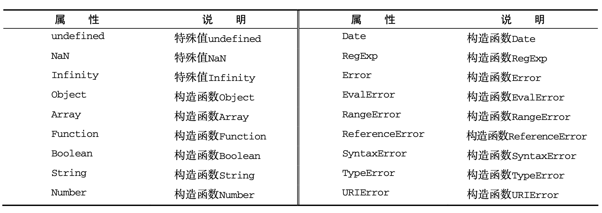
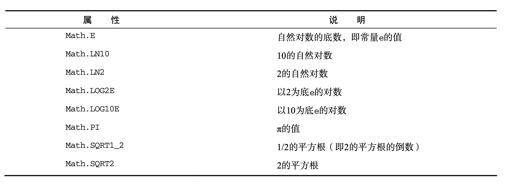
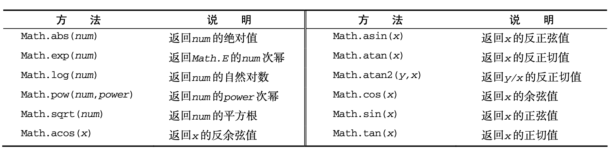

# 单体内置对象

在所有代码执行之前，作用域中就已经存在两个内置对象：`Global` 和 `Math`。

## Global对象   <a id="global"></a>

不属于任何其他对象的属性和方法，最终都是它的属性和方法。事实上，没有全局变量或全局函数;所有在全局作用域中定义的属性和函数，都是 `Global` 对象的属性。如 `isNaN()`、`isFinite()`、`parseInt()` 以及 `parseFloat()`，实际上全都是 `Global` 对象的方法。

### URI编码方法 <a id="uri-encoding-methods"></a>

- **encodeURI()**：主要用于整个 URI(例如，http://www.wrox.com/illegal value.htm)，不会对本身属于 URI 的特殊字符进行编码，例如冒号、正斜杠、 问号和井字号；
  ```js
  var uri = "http://www.wrox.com/illegal value.htm#start";
  alert(encodeURI(uri));   
  // "http://www.wrox.com/illegal%20value.htm#start" 
  ```
- **encodeURIComponent()**：主要用于对 URI 中的某一段(例如前面 URI 中的 illegal value.htm)进行编码，会对它发现的任何非标准字符进行编码。；
  ```js
  var uri = "http://www.wrox.com/illegal value.htm#start"; 
  //"http%3A%2F%2Fwww.wrox.com%2Fillegal%20value.htm%23start"    
  alert(encodeURIComponent(uri));
  ```
两者区别，正是对整个 URI 使用 `encodeURI()`，而只能对附加在现有 URI 后面的字符串使用 `encodeURIComponent()` 的原因所在。使用 `encodeURIComponent()` 方法的时候要比使用 `encodeURI()` 更多，因为在实践中更常见的是对查询字符串参数而不是对基础 URI 进行编码。

- **decodeURI()**：只能对使用 `encodeURI()` 替换的字符进行解码；
- **decodeURIComponent()**：只能对使用 `encodeURIComponent()` 替换的字符进行解码；

### eval()方法 <a id="eval-methods"></a>

`eval()` 方法就像是一个完整的ECMAScript解析器，它只接受一个参数，即要执行的ECMAScript或(JavaScript)字符串。
```js
eval("function sayHi() { alert('hi'); }");
sayHi();
eval("var msg = 'hello world'; "); 
alert(msg); //"hello world"
```
函数 `sayHi()` 是在 `eval()` 内部定义的。但由于对 `eval()` 的调用最终会被替换成定义函数的实际代码，因此可以在下一行调用 `sayHi()`，对于变量也一样；
`eval()` 中创建的任何变量或函数都不会被提升，因为在解析代码的时候，它们被包含在一个字 符串中；它们只在 `eval()` 执行的时候创建；
严格模式下，在外部访问不到 `eval()` 中创建的任何变量或函数，因此前面两个例子都会导致错误。在严格模式下，为 `eval` 赋值也会导致错误；
使用 `eval()` 时必须极为谨慎，特别是在用它执行用户输入数据的情况下。否则，可能会有恶意用户输入危险代码(即所谓的代码注入)。

### Global对象的属性 <a id="global-object-properties"></a>

ECMAScript 5 明确禁止给 `undefined`、`NaN` 和 `Infinity` 赋值，这样做即使在非严格模式下也会导致错误。


### window对象 <a id="window-object"></a>

ECMAScript 虽然没有指出如何直接访问 `Global` 对象，但 Web 浏览器都是将这个全局对象作为 `window` 对象的一部分加以实现的。因此，在全局作用域中声明的所有变量和函数，就都成为了 `window` 对象的属性。
```js
var color = "red";
function sayColor(){ 
  alert(window.color);
}
window.sayColor(); //"red"
// 另一种取得 `Global` 对象的方法:
var global = function(){ 
  return this;
}();
```
`window` 对象详见[第八章](../content/chapter08.md#window-object)。

## Math对象 <a id="math"></a>

为保存数学公式和信息提供了一个公共位置，即 `Math` 对象。

### Math对象的属性 <a id="math-object-properties"></a>


### min()和 max()方法 <a id="min-max"></a>

`min()` 和 `max()` 方法用于确定一组数值中的最小值和最大值。这两个方法都可以接收任意多个数值参数；这两个方法经常用于避免多余的循环和在 `if` 语句中确定一组数的最大值。
```js
var max = Math.max(3, 54, 32, 16); 
alert(max); //54
var min = Math.min(3, 54, 32, 16); 
alert(min); //3
```
找到数组中的最大值或最小值，可以使用 `apply`
```js
var values = [1, 2, 3, 4, 5,  6, 7, 8]
var max = Math.max.apply(Math, values);
```
这个技巧的关键是把 `Math` 对象作为 `apply()` 的第一个参数，从而正确地设置 `this` 值。然后，可以将任何数组作为第二个参数。

### 舍入方法 <a id="rounding"></a>

- **Math.ceil()** 执行向上舍入，即它总是将数值向上舍入为最接近的整数；
- **Math.floor()** 执行向下舍入，即它总是将数值向下舍入为最接近的整数；
- **Math.round()** 执行标准舍入，即它总是将数值四舍五入为最接近的整数；
```js
alert(Math.ceil(25.9)); //26 
alert(Math.ceil(25.5)); //26 
alert(Math.ceil(25.1)); //26
alert(Math.round(25.9)); //26 
alert(Math.round(25.5)); //26 
alert(Math.round(25.1)); //25
alert(Math.floor(25.9)); //25 
alert(Math.floor(25.5)); //25 
alert(Math.floor(25.1)); //25
```

### random()方法 <a id="random"></a>

`Math.random()` 方法返回大于等于 0 小于 1 的一个随机数。套用下面的公式，可以从某个整数范围内随机选择一个值。
```js
值 = Math.floor(Math.random() * 可能值的总数 + 第一个可能的值)
var num = Math.floor(Math.random() * 10 + 1); // 1-10
var num = Math.floor(Math.random() * 9 + 2); // 2-10
// 通过一个函数来计算可能值的总数和第一个可能的值
function selectFrom(lowerValue, upperValue) { 
  var choices = upperValue - lowerValue + 1;
  return Math.floor(Math.random() * choices + lowerValue); 
}
var num = selectFrom(2, 10);
alert(num); // 介于2和10之间(包括2和10)的一个数值
// 利用这个函数，可以方便地从数组中随机 取出一项，例如:
var colors = ["red", "green", "blue", "yellow", "black", "purple", "brown"]; 
var color = colors[selectFrom(0, colors.length-1)];
alert(color); // 可能是数组中包含的任何一个字符串
```

### 其他方法 <a id="others"></a>

不同实现可能会对这些方法采用不同的算法，因此这些方法在不同的实现中可能会有不同的精度。